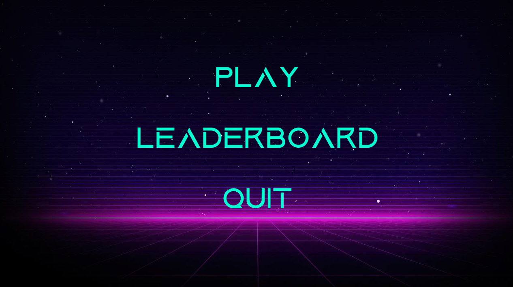
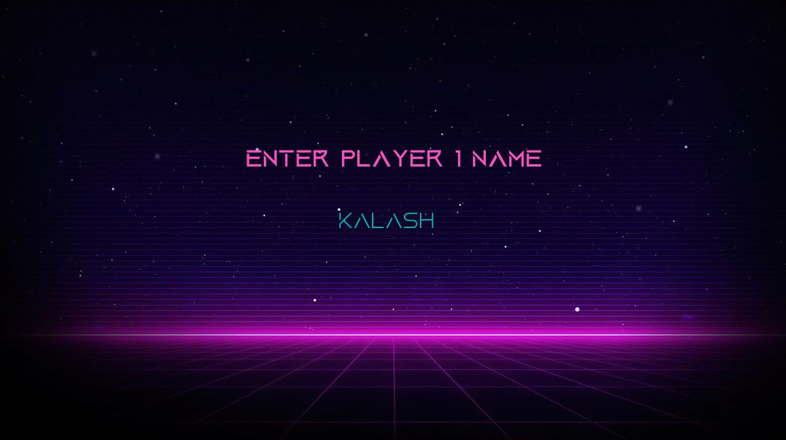
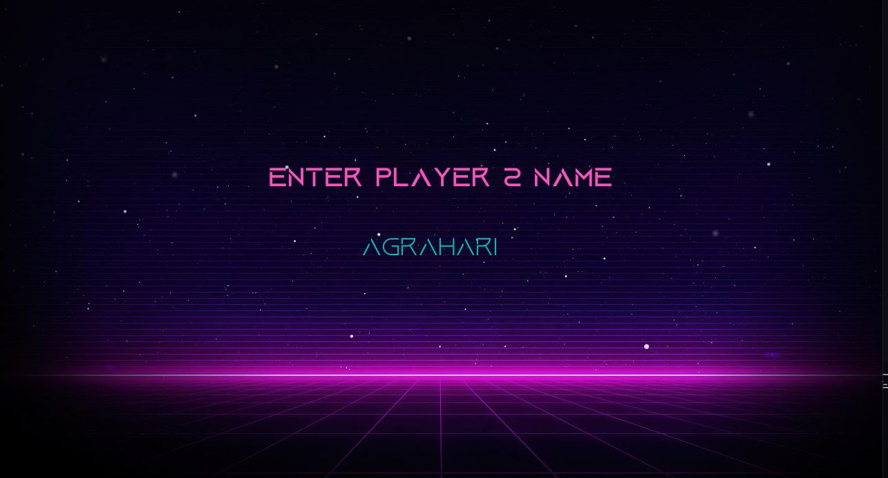
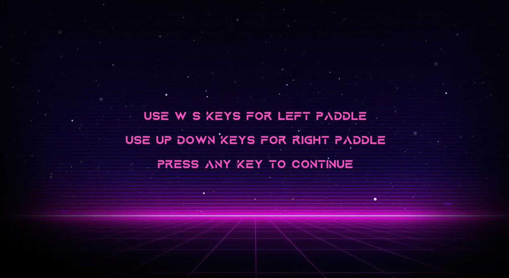
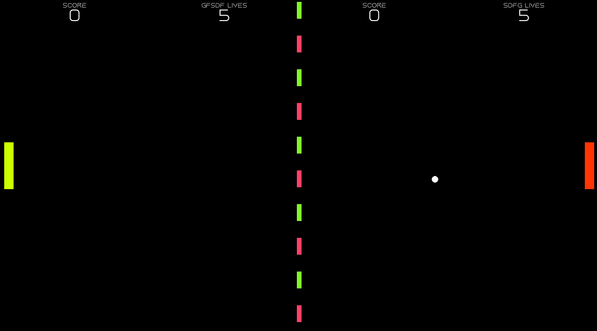

# Bounce Battle

Bounce Battle is an exciting and fast-paced table tennis game developed in Python. This project brings the classic game of ping pong to your screen with smooth graphics and responsive controls. Challenge your friends or test your skills against the AI in this addictive and fun game.

## Features

- **Single Player Mode**: Play against an intelligent AI that adapts to your skill level.
- **Multiplayer Mode**: Challenge your friends in a local multiplayer match.
- **Smooth Graphics**: Enjoy sleek and clean visuals for an immersive gaming experience.
- **Responsive Controls**: Experience precise and responsive paddle control for accurate gameplay.
- **Customizable Settings**: Adjust the game speed, paddle size, and ball dynamics to your liking.

## Snapshots


*Initialization*


*Player - 1*


*Player - 2*


*Game controls*


*Gameplay*


## Installation

1. Clone the repository:
    ```bash
    git clone https://github.com/code2forever/Bounce-Battle.git
    ```

2. Navigate to the project directory:
    ```bash
    cd Bounce-Battle
    ```

3. Install pygame:
    ```bash
    pip install pygame==2.1.2
    ```

4. Install moviepy:
    ```bash
    pip install moviepy==1.0.3
    ```

5. Install numpy:
    ```bash
    pip install numpy==1.21.2
    ```

6. Install tensorflow:
    ```bash
    pip install tensorflow==2.7.0
    ```

7. Install pytorch:
    ```bash
    pip install torch==1.10.0
    ```

8. Install opencv:
    ```bash
    pip install opencv-python==4.5.4
    ```

9. Run the game:
    ```bash
    python ping_pong.py
    ```

## How to Play

- **Player 1 Controls**: Use the `W` and `S` keys to move the paddle up and down.
- **Player 2 Controls**: Use the `Up Arrow` and `Down Arrow` keys to move the paddle up and down.
- The first player to lose 5 lives loses the game.

## Contributing

Contributions are welcome! If you'd like to improve the game, please fork the repository and create a pull request.
